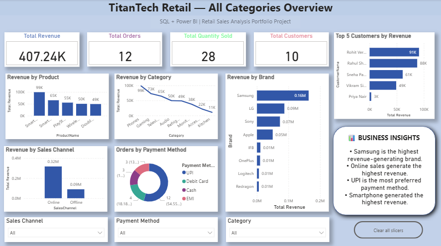
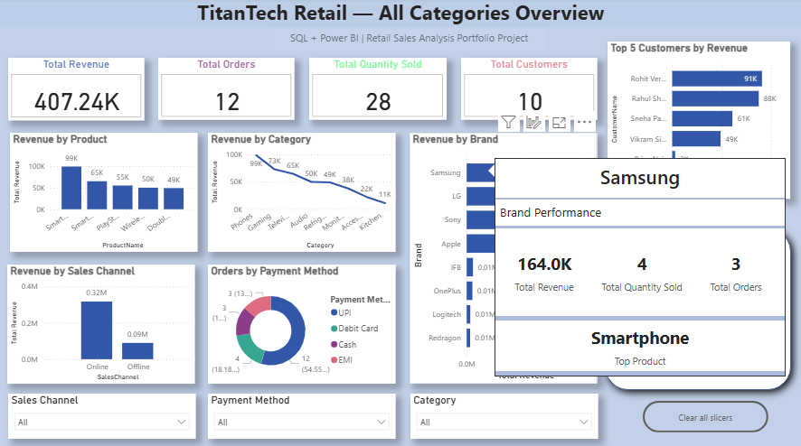
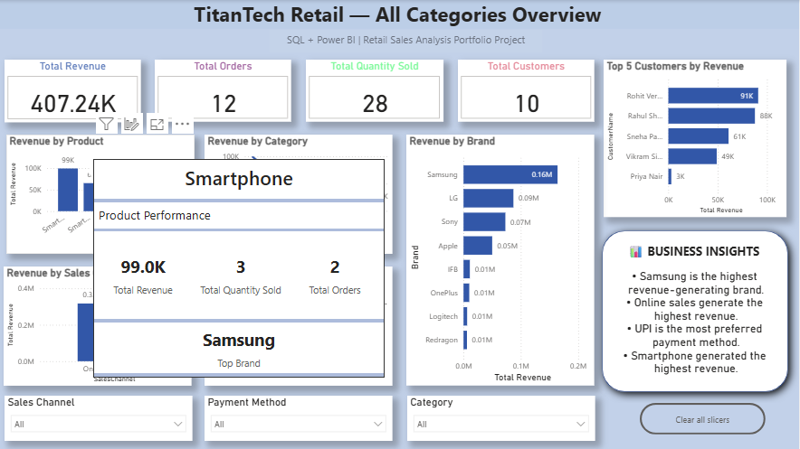

# 🛍️ TitanTech Retail Sales Analytics

## 📌 Project Overview

As part of strengthening my SQL and Power BI skills for data analytics, I designed a retail sales database from scratch using MySQL and built an interactive Power BI dashboard using the same data.

The project demonstrates database design, data insertion, table relationships, SQL-based business analysis, data visualization, and interactive dashboard development.

The database simulates a retail business by managing customers, products, orders, and order details. Using SQL and Power BI, I analyzed the data to answer business questions and generate meaningful insights.

---

## 🗄️ Database Structure

The database consists of four related tables:

- Customers
- Products
- Orders
- OrderDetails

The tables are connected using **Primary Keys** and **Foreign Keys** to maintain data integrity and minimize data redundancy.

---

## 📊 Business Questions Answered

- Which product generated the highest revenue?
- Which product sold the highest number of units?
- Which customer spent the most money?
- Which sales channel generated the highest revenue?
- Which city generated the highest revenue?
- Which brand generated the highest revenue?
- Which payment method was used most frequently?

---

## 📈 Power BI Dashboard

The SQL database was further used to build an interactive Power BI dashboard featuring:

- Revenue and order KPIs
- Revenue by product, category, and brand
- Revenue by sales channel
- Orders by payment method
- Top customers by revenue
- Interactive slicers for Sales Channel, Payment Method, and Category
- Dynamic business insights based on user selections

### Dashboard Overview



### Brand Toolkit



### Product Toolkit



---

## 🛠️ SQL Concepts Demonstrated

- CREATE DATABASE
- CREATE TABLE
- PRIMARY KEY
- FOREIGN KEY
- INSERT INTO
- SELECT
- WHERE
- INNER JOIN
- GROUP BY
- ORDER BY
- LIMIT
- Aggregate Functions (SUM, COUNT)

---

## 💻 Tools Used

- MySQL Workbench
- SQL (MySQL)
- Microsoft Power BI
- DAX
- ChatGPT (used as a learning and guidance tool)

---

## 💡 Key Insights

- **Samsung** generated the highest revenue among the brands.
- **Online sales** generated the highest revenue among the sales channels.
- **UPI** was the most frequently used payment method.
- **Smartphone** generated the highest revenue among the products.
- Power BI's dynamic insights update based on selected categories and filters.

---

## 📁 Project Structure

```text
TitanTech-Retail-Sales-Analytics/
│
├── Images/
│   ├── 01_Dashboard.png
│   ├── 02_Product-Toolkit.png
│   └── 03_Brand-Toolkit.png
│
├── POWERBI/
│   └── TitanTech_Retail Dashboard.pbix
│
├── SQL/
│   ├── 01_Database_Schema.sql
│   ├── 02_Data_Insertion.sql
│   └── 03_Business_Queries.sql
│
└── README.md
```

---

## 👩‍💻 Author

**Tammineni Himagiri**


B.Com Business Analytics
